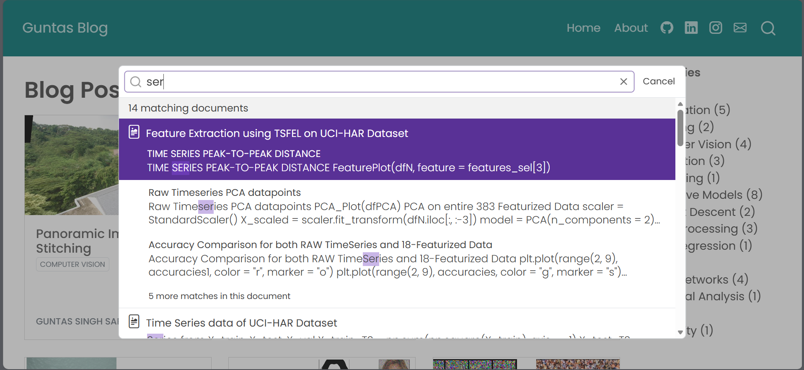
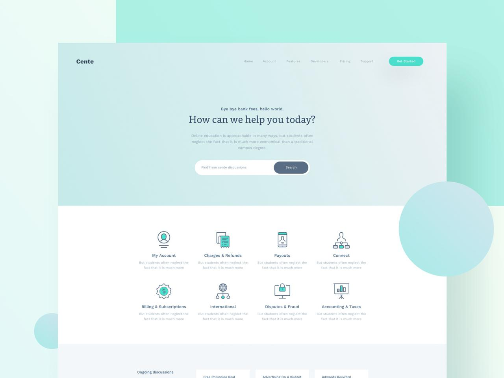

# Rebuilding the Userology Help Center
## From Static Export to Interactive Experience

---

## The Challenge

I received a Zendesk export—24 help articles, 27 tutorial videos, and basic HTML scaffolding. The content was there, but users needed an easier way to find solutions to their Userology-related problems. They couldn't search easily, might feel uncertain about where to start, and could get lost in alphabetically sorted titles.

**My Goal:** Make it super easy for users to find solutions to their problems when using Userology.

This document captures my problem-solving process: what I observed, what I tried, what didn't work as expected, and how I built solutions that prioritize user convenience.


---

## Navigation Map

### Discovery & Analysis

- [Stepping Into the User's Shoes](#stepping-into-the-users-shoes)
- [The Problems I Uncovered](#the-problems-i-uncovered)

### Building Solutions

- [Fixing Search: Making It Actually Work](#fixing-search-making-it-actually-work)
- [Building a Visual Journey Map](#building-a-visual-journey-map)
- [Bringing Userology's Brand to Life](#bringing-userologys-brand-to-life)
- [Mobile: When Desktop Success Isn't Enough](#mobile-when-desktop-success-isnt-enough)
- [Engagement Features That Keep Users Learning](#helping-users-continue-learning)

### Reflection & Results

- [Why I Made These Technical Choices](#why-i-made-these-technical-choices)
- [What Broke and How I Fixed It](#what-broke-and-how-i-fixed-it)
- [What I Built: The Complete Feature Set](#what-i-built-the-complete-feature-set)

---

## Stepping Into the User's Shoes

Before touching any code, I did something crucial: **I became a user.**

I opened the site locally and tried to accomplish basic tasks:

- "I want to set up my first study—where do I start?"
- "I forgot how to configure AI settings—can I search for it?"
- "Are there video tutorials? How do I find them?"
- "I'm on Study Settings, what should I do next?"

**The experience revealed opportunities for improvement.** I found myself scanning long alphabetical lists, clicking the search bar only to realize it wasn't functional, and feeling uncertain about where to begin.

I realized the site could better serve users by presenting documentation as a guided journey rather than just an information repository.

I took notes on every friction point, every moment of confusion, every time I thought "this could be easier." These observations became my roadmap for improvements.

---

## The Problems I Uncovered

After user testing myself, I organized issues by their **impact on user experience**:

### Problem 1: Non-Functional Search

The search bar appeared functional—clean input field, magnifying glass icon, placeholder text saying "Search articles..."—but it wasn't connected to any functionality yet.

**Why this matters:** Users rely on search as a primary navigation tool. When it doesn't work, it can be more confusing than not having a search feature at all.

### Problem 2: Content Organization Opportunity

Opening the All Articles page showed 24 titles in alphabetical order. While alphabetical sorting has its place, it might not be the most helpful primary organization for users.

Users often think in **workflows**: "First I need to create a study, then set it up, then launch it, then analyze results."

**The impact:** New users had no starting point. Advanced users couldn't quickly find what they needed. Everyone wasted time scanning titles hoping something would click.

### Problem 3: Workflow Disconnection

Articles existed in isolation. There was no sense of "you are here" in the broader Userology journey. Someone reading about AI Moderator settings wouldn't know this comes *after* Study Setup and *before* Launch.

**Why context matters:** When users understand where a feature fits in their workflow, they can make better decisions about what to learn next.

### Problem 4: Limited User Engagement

The typical experience was: read an article, then close the tab.

There weren't feedback options ("Was this helpful?"), related content suggestions, or prompts to explore further.

**The opportunity:** Each article could serve as a gateway to deeper learning, guiding users to related topics.

### Problem 5: Visual Consistency Opportunity

The site used a generic blue theme. Userology's product features sophisticated dark purples, space-black backgrounds, and modern glass-morphism effects.

**Why this matters:** When the help center reflects the product's design language, it creates a more cohesive experience for users.

### Problem 6: Mobile Experience Needs Work

The desktop version worked well. On mobile, there were issues: horizontal scrolling in places, small touch targets, and some text overflow.

**Why this matters:** Many users access help on mobile (during setup, troubleshooting on the go). The mobile experience is just as important as desktop.

### My Prioritization Approach

I couldn't address everything simultaneously, so I asked: **What would provide the most value to users first?**

1. **Search** - A foundational navigation feature users expect
2. **Engagement Features** - Help users discover related content and continue learning
3. **Information Architecture** - Better structure helps users find what they need
4. **Visual Consistency** - Cohesive design builds trust
5. **Mobile Experience** - Essential for on-the-go users

This became my development sequence.

---

# SOLUTION 1: Building Functional Search

## Fixing Search: Making It Actually Work

### The Problem-Solving Journey

Search needed to be built from the ground up. The UI existed, but the functionality wasn't implemented yet.

I thought through what users would need from help center search:

- **Speed** - Results appear as they type, no waiting
- **Relevance** - Most important matches show first
- **Context** - Show which category/section each result belongs to
- **Discoverability** - Let them find content even with partial or fuzzy matches

### Building the Solution (with GitHub Copilot)

I broke down the search feature into three parts:

**Part 1: Make content searchable**

Using GitHub Copilot, I created a script that extracts all text from articles—titles, headings, and body content—and organized it into a searchable database. This gave search something to actually work with.

**Part 2: Build smart matching**

I implemented weighted scoring where title matches count most, section headings count less, and body text counts least. This ensures users see the most relevant results first. Added fuzzy matching so typos like "moderater" still find "moderator."

**Part 3: Design the user interface**

Results appear instantly as users type, with keyboard navigation support and category badges showing which section each result belongs to.

### The Bug I Had to Fix

Search worked well on the homepage but encountered issues on article pages.

**Root cause:** The search database file lived in different locations relative to each page type.

**My solution:** Built a smart path resolver that figures out where each page is and automatically constructs the correct path. Now search works from any page, no matter its location in the site structure.

### What I Learned from Other Products

I studied Intercom, Zendesk, and Linear. The pattern was consistent: **instant, inline results**. No "submit and wait" experience. No separate results page.

Users have been trained by Google to expect instant feedback. Fighting this expectation would just frustrate them.


*The search features I aimed to implement*

---

# SOLUTION 2: Creating a Visual Journey Map

## Building a Visual Journey Map

### The User Experience Problem

The homepage listed articles alphabetically. While organized, this didn't answer the key question new users often have.

**What users often wonder:** "I just signed up for Userology. What do I do first?"

An alphabetical list doesn't naturally guide users through a workflow.


*Centered search pattern from modern help centers*

### The Breakthrough Idea

I realized: **Users need to see the workflow, not just the content.**

To understand Userology's natural user journey, I used Claude (Anthropic's AI assistant) to help me analyze the article content and map out the logical workflow progression. This revealed a clear path:

```text
Study Setup → Interview Plan → Study Settings → Launch → 
Collect Responses → Analyze Results
```

What if I *showed* this journey visually?

### Designing the Tree-Line Roadmap

Instead of a flat list, I created a vertical timeline with:

- **6 numbered nodes** representing workflow stages
- **Connecting lines** showing progression
- **Topic cards** branching from each node
- **Smooth animations** (fade-in on scroll, subtle pulse on hover)

**Visual design choices:**

- Purple gradient spine (matches brand)
- Cards with glass-morphism effect (modern, matches product UI)
- Each node clearly labeled with stage number
- Articles grouped under relevant stages

### The Impact on User Experience

**Before:** "Where do I start?" → *scans article titles* → *uncertain which to choose*

**After:** "Where do I start?" → *sees Node 1: Study Setup* → *clicks relevant card*

The roadmap helps organize content and teaches the Userology workflow. Users can learn the product structure while finding the help they need.

### Building It with Copilot

GitHub Copilot accelerated development by generating smooth animations and visual effects. I described the experience I wanted—cards fading in gracefully, subtle movements on hover—and Copilot handled the implementation details.

---

# SOLUTION 3: Visual Consistency with Product

## Bringing Userology's Brand to Life

### The Visual Consistency Opportunity

The help center used a generic blue theme with basic styling.

Meanwhile, Userology's main website featured sophisticated dark purple gradients, space-black backgrounds, and modern glass effects.

**The opportunity:** Aligning the help center's visual design with the product would create a more cohesive experience.

### Matching the Product's Visual Style

I analyzed Userology's website to extract design patterns:

- Captured key sections to understand the aesthetic
- Used browser tools to inspect elements
- Extracted color values and gradient patterns
- Documented spacing and typography


*Color palette and typography from Userology's main website*

**Colors I captured:**

- Deep space black backgrounds
- Signature purple brand color throughout
- Subtle purple-tinted card backgrounds
- Barely visible separation lines


*Card styling reference from the main product*

### Applying the Visual Patterns

**Card styling:**

Implemented glass-morphism effects with semi-transparent backgrounds, blur effects, and purple borders to match the main product.


*Purple gradient patterns from Userology's design system*

**Interactive elements:**

Added hover effects where cards lift slightly with a purple glow for better user feedback.

**Typography:**

- Figtree for body text
- Inter for headings

### Fixing Text Readability

White text on gradient backgrounds had visibility issues in some areas.


*Before: Text visibility issues on gradient backgrounds*

**The fix:** Removed gradient styling from text elements to prevent conflicts.


*After: Improved text clarity*

Applied this to roadmap titles, video cards, article headings, and related article sections.

### The Deployment Cache Battle

Pushed updated styles to GitHub Pages. Refreshed browser. Nothing changed.

**The culprit:** Aggressive browser and CDN caching.

**My solution:** Added version numbers to file references. Now every update increments the version, forcing browsers to download fresh files instead of using cached versions.


*Debugging layout issues during development*


---

# SOLUTION 4: Mobile Optimization

## Mobile: When Desktop Success Isn't Enough

### Learning from Real Devices

Chrome DevTools mobile simulator showed everything working well. Responsive breakpoints triggered correctly, layouts adapted nicely.

Then I tested on my actual phone and discovered several issues:

- Article cards caused some horizontal scrolling
- Touch targets could be larger for easier tapping
- Some text sizes needed adjustment
- Navigation layout needed refinement


*Debugging layout alignment issues discovered during testing*


*Refining spacing and layout for better visual hierarchy*

**Important lesson:** Simulators are helpful, but real device testing reveals issues you might otherwise miss.

### Understanding the Grid Overflow Bug

The core issue was how the layout behaved on narrow screens. Cards were set to never shrink below 280 pixels wide. On a 375-pixel phone screen, this seemed fine—until you add padding, borders, and margins. Suddenly you exceed viewport width and horizontal scrolling appears.

**Why this happens:** The layout was told "never go below 280px, even if the container is narrower."

### The Fix That Actually Worked

I changed the logic to: "Use 280px *unless* that exceeds screen width, then use full screen width instead."

Plus essential mobile foundations—making sure padding and borders are included in width calculations, preventing child elements from forcing overflow.

### Responsive Breakpoint Strategy

I set up three tiers:

**768px and below:** 2-column grids become 1 column, reduce spacing

**640px and below:** Increase font sizes (mobile users hold phones closer), simplify navigation to vertical stacking

**480px and below:** Minimal UI, maximum content

### Video Carousel Mobile Experience

**Desktop:** 3 videos visible at once

**Mobile:** Show one video at a time, but let 15% of the next video peek out to signal "swipe for more." Added smooth snap-to-card scrolling so videos don't end up half-visible.

### Touch Target Accessibility

Apple's guidelines recommend 44-pixel minimum touch targets. I was using 36-pixel buttons—too small for comfortable tapping.

**Fix:** Increased button size and padding to meet accessibility standards. Now all interactive elements are easily tappable without precision targeting.

### Testing Process I Adopted

1. Build feature on desktop
2. Test in DevTools simulator (catches many issues)
3. **Test on actual iPhone** (reveals device-specific issues)
4. Test on Android phone (different rendering engine)
5. Test in landscape orientation
6. Test with slow network conditions

This comprehensive testing helps ensure a good experience across devices.

---

# SOLUTION 6: Engagement & Discovery Features

## Helping Users Continue Learning

**Article Feedback:** Thumbs up/down buttons on every article with optional comments for "not helpful" votes. Helps identify which content needs improvement.

**Related Articles:** 72 manually curated suggestions (3 per article) based on workflow sequence, not just keyword matching. Guides users through logical learning paths.

**Breadcrumb Navigation:** Shows article location in site hierarchy (Home > Section > Article), helping users orient themselves and navigate back up.

**Enhanced Search Results:** Category badges show which section each result belongs to before clicking.

**Automation:** Python script to add all engagement features across 24 articles consistently.

---

## Why I Made These Technical Choices

| Decision | Options Considered | Choice Made | Benefits | Trade-offs |
|----------|-------------------|-------------|----------|-----------|
| **Tech Stack** | • React (component reusability, state management)<br>• Vue (simpler learning curve)<br>• Static site generators (automated builds) | **Plain HTML/CSS/JS** | • Free hosting (GitHub Pages)<br>• Zero build complexity<br>• Instant load times<br>• SEO-friendly<br>• Long-term stability | • Manual content updates<br>• Some file repetition<br>• No live preview |
| **Search Implementation** | • Algolia (powerful, expensive)<br>• Third-party search libraries<br>• Custom build | **Custom JavaScript search** | • Full control over relevance<br>• No dependencies/costs<br>• Instant results (no network)<br>• Lightweight | • 2 hours development time |
| **Related Articles** | • Algorithmic keyword matching<br>• Manual curation | **Manual curation** | • Workflow-aware suggestions<br>• Intent-based recommendations<br>• Quality learning paths | • 3 hours to map 72 relationships |

---

## What Broke and How I Fixed It

| Bug | Problem | Attempts & Results | Final Solution | Lesson Learned |
|-----|---------|-------------------|----------------|----------------|
| **1. Search Path Issues** | Search worked on homepage, broke on article pages in subdirectories | 1. Hardcoded paths → broke some pages<br>2. URL conditionals → messy edge cases | Smart path resolver that dynamically calculates folder depth | Make logic dynamic instead of hardcoding edge cases |
| **2. Mobile Grid Overflow** | Cards caused horizontal scrolling on narrow screens | 1. Inspected elements<br>2. Found minimum width rules<br>3. Researched responsive techniques | Adaptive width logic using modern CSS | Modern CSS has elegant solutions for responsive design |
| **3. Text on Gradients** | White text on purple gradients became unreadable | 1. Forced white color → gradient bled through<br>2. Added shadows → text became blurry | Removed gradient styling from text elements entirely | Keep gradients decorative, keep text simple |
| **4. GitHub Pages Cache** | Style changes didn't appear after deployment | 1. Checked GitHub → updated ✓<br>2. Checked browser → old version loading | Version numbering system (style.css?v=20251129) | Use cache-busting version parameters |
| **5. Special Characters in Search** | Searching "AI moderator?" broke results | Used Copilot: "Escape special characters in user search input" | Sanitization function handles all special chars | Always sanitize user input, even for search |

---

## What I Built: The Complete Feature Set

### Core Infrastructure

**Modified Files:**

- 4 main pages: `index.html`, `categories.html`, `articles.html`, `videos.html`
- 24 article pages: all `article_*.html` files
- 7 section pages: all `section_*.html` files
- Styles: `css/style.css` (~600 lines added)
- JavaScript: `js/main.js` (~300 lines added)
- Python scripts: `generate_search_index.py`, `enhance_articles.py`

### Features Shipped

**Search & Discovery:**

- Real-time search with weighted relevance (titles ranked highest)
- Keyboard navigation (arrow keys + Enter)
- Category badges showing article sections
- Smart performance optimization
- Fuzzy matching (handles typos gracefully)
- Works from any page depth

**Information Architecture:**

- Tree-line workflow roadmap (6-stage visual journey)
- Breadcrumb navigation on all pages
- Clear hierarchy: Home → Category → Section → Article

**Visual Design:**

- Dark theme matching Userology brand
- Glass-morphism effects (blur, transparency, subtle borders)
- Smooth animations (fade-in, hover effects, pulse)
- Typography: Figtree + Inter fonts
- Gradient accents matching product UI

**User Engagement:**

- Article feedback system (helpful/not helpful + comments)
- 72 manually curated related article suggestions (24 articles × 3 each)
- Vote persistence across sessions
- Analytics hooks (ready for future integration)

**Mobile Experience:**

- Responsive layouts (1-3 columns based on viewport)
- Touch-friendly interactive elements (44px minimum)
- Video carousel with snap scrolling
- Optimized font sizes
- Tested on actual devices (iPhone, Android)

**Automation Tools:**

- Python scripts for bulk updates
- Search index generator
- Article enhancement automation
- Version management workflow

### GitHub Copilot's Role

Throughout this project, I used GitHub Copilot as my AI coding assistant:

- **Search implementation:** Generated content extraction logic and scoring algorithms
- **Visual effects:** Created animations and transitions
- **Utilities:** Path resolvers, debounce functions, data storage handling
- **Automation scripts:** Bulk article enhancement tools
- **Bug fixes:** Input sanitization, path resolution logic
- **Responsive design:** Layout patterns and adaptive techniques

Copilot accelerated development by handling implementation details while I focused on user experience decisions and workflow design. Instead of wrestling with syntax, I spent time thinking through user problems and designing solutions.

---

## Final Reflection

This project taught me that **good documentation is about guiding users, not just storing information.**

The Zendesk export provided all the content. What I hoped to add was:

- **User perspective:** Considering how someone new to the platform might feel
- **Structure:** Showing the workflow alongside individual articles
- **Functionality:** Building working search and navigation
- **Connection:** Helping users discover related topics
- **Consistency:** Aligning design with the product experience

Every feature started with a question about user needs:

- "How can I find what I need quickly?" → Search
- "Where should I start?" → Workflow roadmap
- "Does this feel like Userology?" → Visual consistency
- "Can I use this on my phone?" → Mobile optimization
- "What should I explore next?" → Related articles

The technical implementation was important, but **understanding user needs came first.**

With GitHub Copilot helping with implementation, I could spend more time on user experience thinking and workflow design.

---

## AI Tools Used

Throughout this project, I leveraged multiple AI assistants:

- **Claude (Anthropic's AI):** Analyzed article content to map out the logical workflow progression for the roadmap
- **GitHub Copilot (Sonnet model):** Generated code implementations, animations, utilities, and automation scripts
- **ChatGPT:** Assisted with problem-solving approaches and documentation refinement

Each tool played a specific role in accelerating development while I focused on user experience and design decisions.

---

**Live Site:** [Userology Help Center](https://dhruvi-sisodiya.github.io/userology-helpdesk/)

*Built with HTML, CSS, JavaScript, Python, and AI-assisted development.*

*This documentation reflects my problem-solving journey—what I observed, what I tried, what I learned, and how I approached building solutions.*
