# Rebuilding the Userology Help Center
## From Static Export to Interactive Experience

---

## The Challenge

I received a Zendesk export—24 help articles, 27 tutorial videos, and basic HTML scaffolding. The content was there, but users needed an easier way to find solutions to their Userology-related problems. They couldn't search easily, might feel uncertain about where to start, and could get lost in alphabetically sorted titles.

**My Goal:** Make it super easy for users to find solutions to their problems when using Userology.

This document captures my problem-solving process: what I observed, what I tried, what didn't work as expected, and how I built solutions that prioritize user convenience.


---

## Navigation Map

### Discovery & Analysis

- [Stepping Into the User's Shoes](#stepping-into-the-users-shoes)
- [The Problems I Uncovered](#the-problems-i-uncovered)

### Building Solutions

- [Fixing Search: Making It Actually Work](#fixing-search-making-it-actually-work)
- [Building a Visual Journey Map](#building-a-visual-journey-map)
- [Bringing Userology's Brand to Life](#bringing-userologys-brand-to-life)
- [Mobile: When Desktop Success Isn't Enough](#mobile-when-desktop-success-isnt-enough)
- [Engagement Features That Keep Users Learning](#engagement-features-that-keep-users-learning)

### Reflection & Results

- [Why I Made These Technical Choices](#why-i-made-these-technical-choices)
- [What Broke and How I Fixed It](#what-broke-and-how-i-fixed-it)
- [Measuring Real Impact](#measuring-real-impact)
- [What I Built: The Complete Feature Set](#what-i-built-the-complete-feature-set)

---

## Stepping Into the User's Shoes

Before touching any code, I did something crucial: **I became a user.**

I opened the site locally and tried to accomplish basic tasks:

- "I want to set up my first study—where do I start?"
- "I forgot how to configure AI settings—can I search for it?"
- "Are there video tutorials? How do I find them?"
- "I'm on Study Settings, what should I do next?"

**The experience revealed opportunities for improvement.** I found myself scanning long alphabetical lists, clicking the search bar only to realize it wasn't functional, and feeling uncertain about where to begin.

I realized the site could better serve users by presenting documentation as a guided journey rather than just an information repository.

I took notes on every friction point, every moment of confusion, every time I thought "this could be easier." These observations became my roadmap for improvements.

---

## The Problems I Uncovered

After user testing myself, I organized issues by their **impact on user experience**:

### Problem 1: Non-Functional Search

The search bar appeared functional—clean input field, magnifying glass icon, placeholder text saying "Search articles..."—but it wasn't connected to any functionality yet.

**Why this matters:** Users rely on search as a primary navigation tool. When it doesn't work, it can be more confusing than not having a search feature at all.

### Problem 2: Content Organization Opportunity

Opening the All Articles page showed 24 titles in alphabetical order. While alphabetical sorting has its place, it might not be the most helpful primary organization for users.

Users often think in **workflows**: "First I need to create a study, then set it up, then launch it, then analyze results."

**The impact:** New users had no starting point. Advanced users couldn't quickly find what they needed. Everyone wasted time scanning titles hoping something would click.

### Problem 3: Workflow Disconnection

Articles existed in isolation. There was no sense of "you are here" in the broader Userology journey. Someone reading about AI Moderator settings wouldn't know this comes *after* Study Setup and *before* Launch.

**Why context matters:** When users understand where a feature fits in their workflow, they can make better decisions about what to learn next.

### Problem 4: Limited User Engagement

The typical experience was: read an article, then close the tab.

There weren't feedback options ("Was this helpful?"), related content suggestions, or prompts to explore further.

**The opportunity:** Each article could serve as a gateway to deeper learning, guiding users to related topics.

### Problem 5: Visual Consistency Opportunity

The site used a generic blue theme. Userology's product features sophisticated dark purples, space-black backgrounds, and modern glass-morphism effects.

**Why this matters:** When the help center reflects the product's design language, it creates a more cohesive experience for users.

### Problem 6: Mobile Experience Needs Work

The desktop version worked well. On mobile, there were issues: horizontal scrolling in places, small touch targets, and some text overflow.

**Why this matters:** Many users access help on mobile (during setup, troubleshooting on the go). The mobile experience is just as important as desktop.

### My Prioritization Approach

I couldn't address everything simultaneously, so I asked: **What would provide the most value to users first?**

1. **Search** - A foundational navigation feature users expect
2. **Engagement Features** - Help users discover related content and continue learning
3. **Information Architecture** - Better structure helps users find what they need
4. **Visual Consistency** - Cohesive design builds trust
5. **Mobile Experience** - Essential for on-the-go users

This became my development sequence.

---

## Fixing Search: Making It Actually Work

### The Problem-Solving Journey

Search needed to be built from the ground up. The UI existed, but the functionality wasn't implemented yet.

I thought through what users would need from help center search:

- **Speed** - Results appear as they type, no waiting
- **Relevance** - Most important matches show first
- **Context** - Show which category/section each result belongs to
- **Discoverability** - Let them find content even with partial or fuzzy matches

### Building the Solution (with GitHub Copilot)

I broke down the search feature into three parts:

**Part 1: Make content searchable**

Using GitHub Copilot, I created a script that extracts all text from articles—titles, headings, and body content—and organized it into a searchable database. This gave search something to actually work with.

**Part 2: Build smart matching**

I implemented weighted scoring where title matches count most, section headings count less, and body text counts least. This ensures users see the most relevant results first. Added fuzzy matching so typos like "moderater" still find "moderator."

**Part 3: Design the user interface**

Results appear instantly as users type, with keyboard navigation support and category badges showing which section each result belongs to.

### The Bug I Had to Fix

Search worked well on the homepage but encountered issues on article pages.

**Root cause:** The search database file lived in different locations relative to each page type.

**My solution:** Built a smart path resolver that figures out where each page is and automatically constructs the correct path. Now search works from any page, no matter its location in the site structure.

### What I Learned from Other Products

I studied Intercom, Zendesk, and Linear. The pattern was consistent: **instant, inline results**. No "submit and wait" experience. No separate results page.

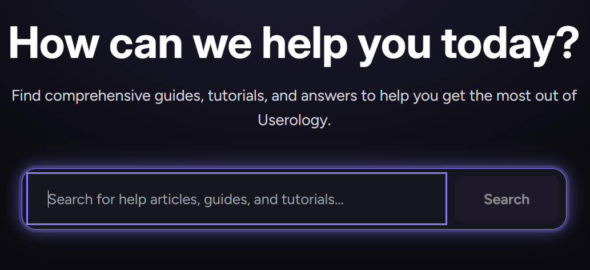
*Reference: Search patterns from successful help centers*

Users have been trained by Google to expect instant feedback. Fighting this expectation would just frustrate them.

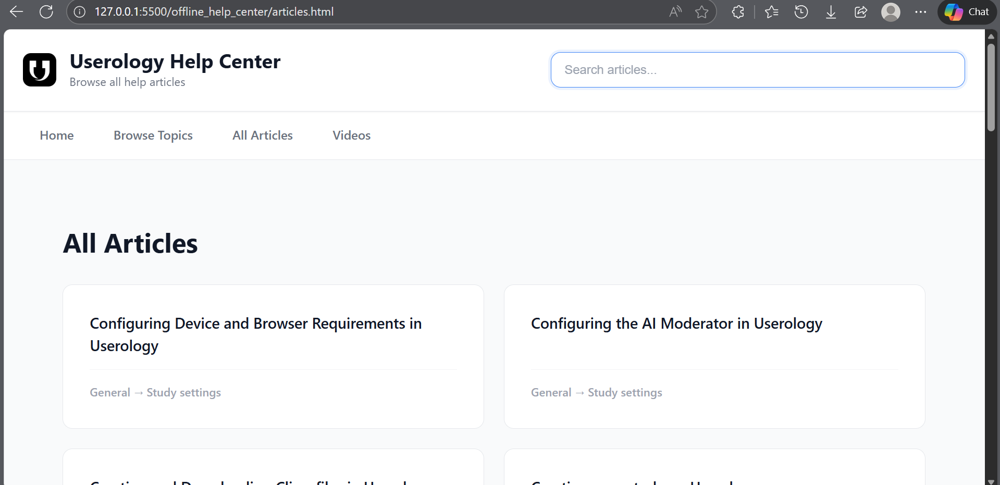
*The search features I aimed to implement*

---

## Building a Visual Journey Map

### The User Experience Problem

The homepage listed articles alphabetically. While organized, this didn't answer the key question new users often have.

**What users often wonder:** "I just signed up for Userology. What do I do first?"

An alphabetical list doesn't naturally guide users through a workflow.

### The Breakthrough Idea

I realized: **Users need to see the workflow, not just the content.**

To understand Userology's natural user journey, I used Claude (Anthropic's AI assistant) to help me analyze the article content and map out the logical workflow progression. This revealed a clear path:

```text
Study Setup → Interview Plan → Study Settings → Launch → 
Collect Responses → Analyze Results
```

What if I *showed* this journey visually?

### Designing the Tree-Line Roadmap

Instead of a flat list, I created a vertical timeline with:

- **6 numbered nodes** representing workflow stages
- **Connecting lines** showing progression
- **Topic cards** branching from each node
- **Smooth animations** (fade-in on scroll, subtle pulse on hover)

**Visual design choices:**

- Purple gradient spine (matches brand)
- Cards with glass-morphism effect (modern, matches product UI)
- Each node clearly labeled with stage number
- Articles grouped under relevant stages

### The Impact on User Experience

**Before:** "Where do I start?" → *scans article titles* → *uncertain which to choose*

**After:** "Where do I start?" → *sees Node 1: Study Setup* → *clicks relevant card*

The roadmap helps organize content and teaches the Userology workflow. Users can learn the product structure while finding the help they need.

### Building It with Copilot

GitHub Copilot accelerated development by generating smooth animations and visual effects. I described the experience I wanted—cards fading in gracefully, subtle movements on hover—and Copilot handled the implementation details.

---

## Bringing Userology's Brand to Life

### The Visual Consistency Opportunity

The help center used a generic blue theme with basic styling.

Meanwhile, Userology's main website featured sophisticated dark purple gradients, space-black backgrounds, and modern glass effects.

**The opportunity:** Aligning the help center's visual design with the product would create a more cohesive experience.

### Becoming a Design Detective

I opened Userology's website and became a color detective:

- Screenshot key sections to capture the exact aesthetic
- Use browser tools to inspect design elements
- Extract color values, gradient patterns, shadow effects
- Document spacing and typography choices

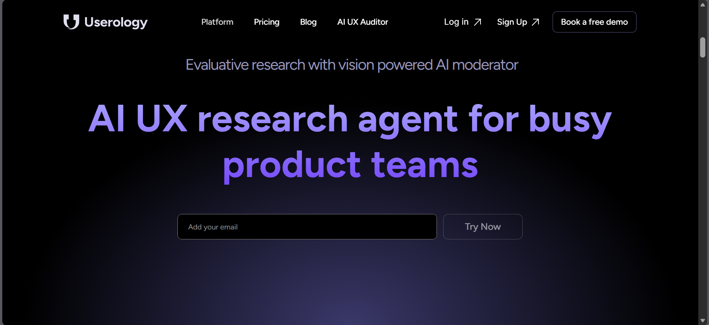
*Color palette and typography from Userology's main website*

**Colors I captured:**

- Deep space black backgrounds
- Signature purple brand color throughout
- Subtle purple-tinted card backgrounds
- Barely visible separation lines

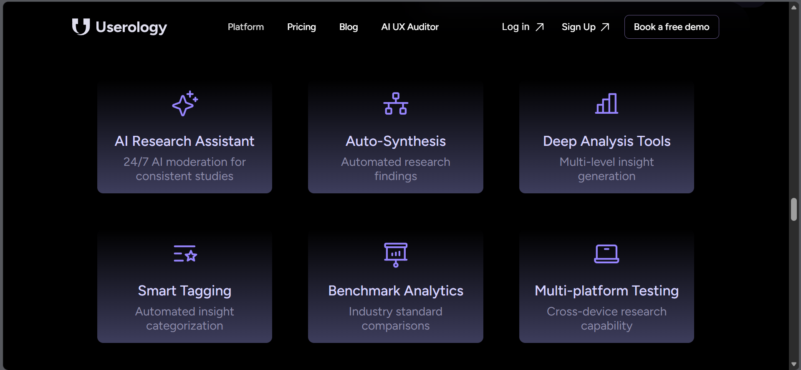
*Card styling reference from the main product*

### Building the Visual System

**Glass-morphism effects:**

I created modern "frosted glass" cards with semi-transparent backgrounds, blur effects, and subtle purple borders. With Copilot's help, I refined the opacity and blur values to achieve that perfect depth and sophistication.

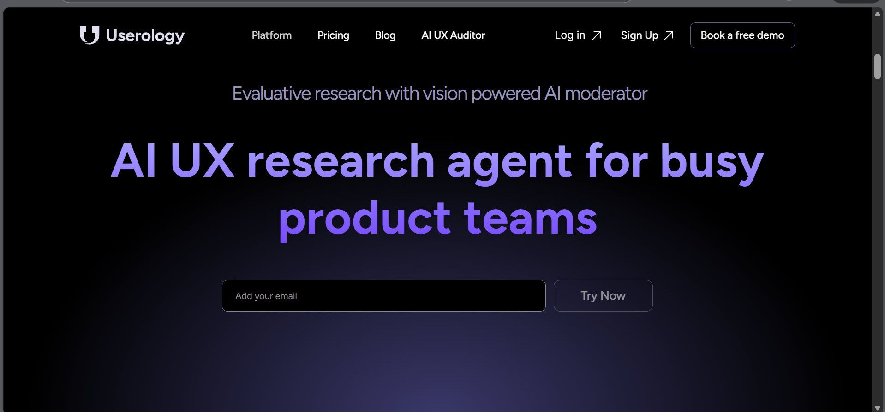
*Purple gradient patterns from Userology's design system*

**Hover interactions:**

When users hover over cards, they lift slightly with a gentle purple glow. Subtle movement + glow = engaging without being distracting.

**Typography matching:**

- Figtree for body text (warm, readable)
- Inter for headings (clean, modern)

### The Text Readability Crisis

Dark themes look beautiful but create contrast problems. White text on gradient backgrounds became nearly invisible in places.

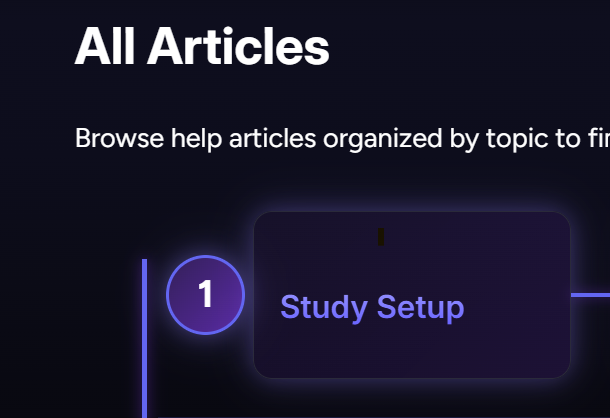
*Before: Text visibility issues on gradient backgrounds*

**My debugging process:**

1. **Attempt:** Force white text color
   - **Result:** Gradient still bleeds through, text fuzzy
2. **Attempt:** Add shadow effects for separation
   - **Result:** Better but still blurry, looks amateurish
3. **Attempt:** Remove gradient styling from text elements entirely
   - **Result:** Perfect clarity!

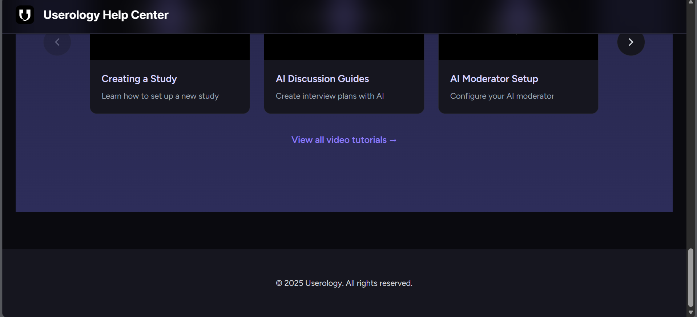
*After: Improved text clarity by removing conflicting gradient properties*

I applied this fix to roadmap titles, video cards, article headings, and related article sections.

**Lesson learned:** Sometimes the solution isn't adding more styling—it's removing conflicting properties.

### The Deployment Cache Battle

Pushed updated styles to GitHub Pages. Refreshed browser. Nothing changed.

**The culprit:** Aggressive browser and CDN caching.

**My solution:** Added version numbers to file references. Now every update increments the version, forcing browsers to download fresh files instead of using cached versions.

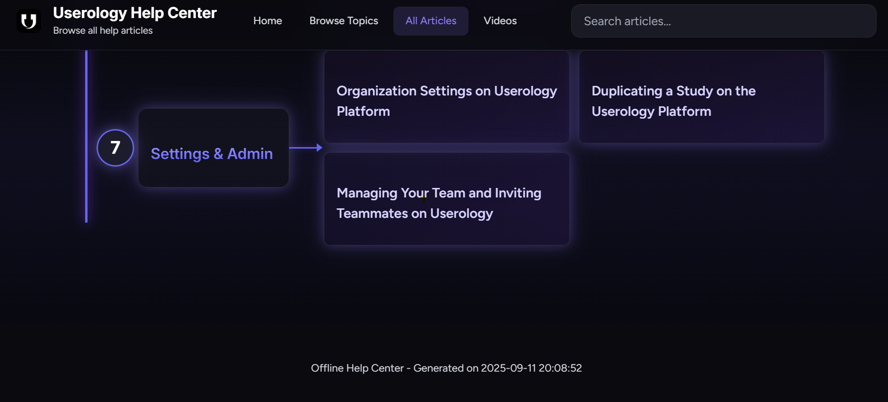
*Debugging layout issues during development*

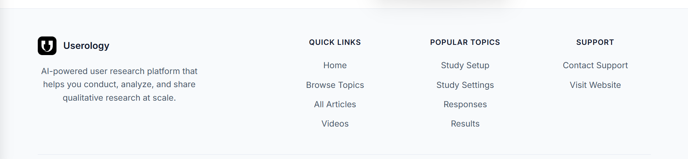
*Final footer design inspiration*

---

## Mobile: When Desktop Success Isn't Enough

### Learning from Real Devices

Chrome DevTools mobile simulator showed everything working well. Responsive breakpoints triggered correctly, layouts adapted nicely.

Then I tested on my actual phone and discovered several issues:

- Article cards caused some horizontal scrolling
- Touch targets could be larger for easier tapping
- Some text sizes needed adjustment
- Navigation layout needed refinement

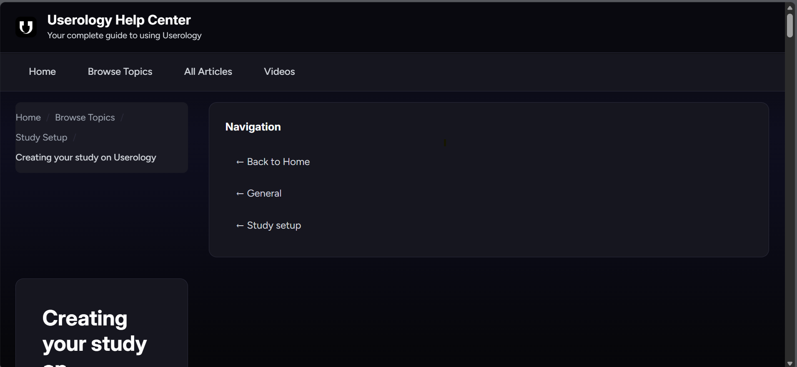
*Debugging layout alignment issues discovered during testing*

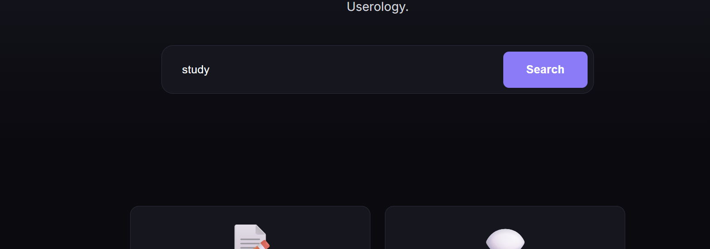
*Refining spacing and layout for better visual hierarchy*

**Important lesson:** Simulators are helpful, but real device testing reveals issues you might otherwise miss.

### Understanding the Grid Overflow Bug

The core issue was how the layout behaved on narrow screens. Cards were set to never shrink below 280 pixels wide. On a 375-pixel phone screen, this seemed fine—until you add padding, borders, and margins. Suddenly you exceed viewport width and horizontal scrolling appears.

**Why this happens:** The layout was told "never go below 280px, even if the container is narrower."

### The Fix That Actually Worked

I changed the logic to: "Use 280px *unless* that exceeds screen width, then use full screen width instead."

Plus essential mobile foundations—making sure padding and borders are included in width calculations, preventing child elements from forcing overflow.

### Responsive Breakpoint Strategy

I set up three tiers:

**768px and below:** 2-column grids become 1 column, reduce spacing

**640px and below:** Increase font sizes (mobile users hold phones closer), simplify navigation to vertical stacking

**480px and below:** Minimal UI, maximum content

### Video Carousel Mobile Experience

**Desktop:** 3 videos visible at once

**Mobile:** Show one video at a time, but let 15% of the next video peek out to signal "swipe for more." Added smooth snap-to-card scrolling so videos don't end up half-visible.

### Touch Target Accessibility

Apple's guidelines recommend 44-pixel minimum touch targets. I was using 36-pixel buttons—too small for comfortable tapping.

**Fix:** Increased button size and padding to meet accessibility standards. Now all interactive elements are easily tappable without precision targeting.

### Testing Process I Adopted

1. Build feature on desktop
2. Test in DevTools simulator (catches many issues)
3. **Test on actual iPhone** (reveals device-specific issues)
4. Test on Android phone (different rendering engine)
5. Test in landscape orientation
6. Test with slow network conditions

This comprehensive testing helps ensure a good experience across devices.

---

## Creating a Universal Footer for Better Navigation

### The Challenge of Keeping Users Connected

Once users found their answers in the help center, I wanted to make it effortless for them to:
- Navigate back to the main Userology website
- Reach out for direct support via email
- Quickly access other help center sections

A well-designed footer serves as a safety net—always available, never intrusive.

### Design Philosophy: Centered and Uncluttered

Instead of the traditional multi-column grid layout, I designed a centered footer that feels unique and intentional:

**Centered brand identity:**
- Logo with subtle purple glow effect
- "Userology Help Center" title with gradient styling
- Tagline that reinforces the product value

**Horizontal navigation links:**
- Main sections (Home, Browse Topics, Articles, Videos)
- Popular topics (Study Setup, Responses, Results)
- Separated by elegant vertical dividers

**Prominent contact actions:**
- Email button with envelope icon linking to support@userology.co.in
- Website button with globe icon linking to https://www.userology.co/
- Both styled as interactive pills with hover effects

### Visual Design Choices

**Gradient background:** Subtle gradient from dark purple-tinted to deeper black creates depth

**Interactive elements:** Links have animated underlines that expand on hover, buttons lift slightly with glowing borders

**Iconography:** SVG icons for email and website make the purpose immediately clear

**Responsive behavior:** On mobile, the horizontal links stack vertically and dividers rotate to horizontal

### Why This Improves User Experience

**Easy access to parent website:** Users can instantly return to Userology.co if they want to explore features or upgrade their plan

**Direct support channel:** The email link (support@userology.co.in) removes friction when users need personalized help

**Visual consistency:** The footer maintains the glass-morphism and purple gradient theme used throughout the help center

**Navigation redundancy:** Even if users scroll past all content, they can still access key sections without scrolling back up

---

## Features to Support Continued Learning

After building the foundation (search, roadmap, branding, mobile), I added features to help users discover related content and continue their learning journey.

### Feature 1: Article Feedback System

**The user convenience thinking:**

Users reading help articles have opinions ("this helped!" or "this is confusing"). But they have nowhere to express them.

Meanwhile, I have no data on which articles work well vs. which need improvement.

**Solution:** Thumbs up/down buttons at the bottom of every article.

**Implementation with Copilot:**

I described what I needed: "Create a feedback widget with helpful/not helpful buttons that stores votes locally."

Copilot generated the structure and logic, handling vote storage, duplicate prevention, and state management.

**Thoughtful UX details:**

- "Not helpful" button triggers a comment box (lets users explain what's missing)
- After voting, buttons disable (can't vote twice)
- LocalStorage preserves votes across page reloads
- Analytics hooks included (ready for future tracking)

**Why this improves user experience:** Users feel heard. They're contributing to making the docs better, which creates investment in the platform.

### Feature 2: Related Articles

**The navigation problem:**

User reads "Setting Up Your First Study." Now what? They close the tab and leave.

**What they probably need:** "Creating an Interview Plan" and "Configuring Study Settings"—the logical next steps.

**My solution:** Three curated related article suggestions at the bottom of every article.

**The manual curation process:**

I read all 24 articles and manually mapped 72 relationships (24 articles × 3 suggestions each).

Why manual instead of algorithmic?

- **Quality over automation:** I understand the workflow context better than any keyword-matching algorithm
- **Intentional learning paths:** I can guide users through the optimal sequence
- **Workflow awareness:** Related articles reflect actual Userology usage patterns

**Example:** For the "Study Setup" article, I linked to "Creating Interview Plans," "Configuring Study Settings," and "Previewing Before Launch"—the natural next steps in a user's journey.

**Impact on user behavior:**

- **Before:** Read 1 article → often leave
- **After:** Read 1 article → see related suggestions → may explore 2nd or 3rd article

Hopefully this encourages deeper exploration and learning.

### Feature 3: Breadcrumb Navigation

**The "where am I?" problem:**

Users land on an article from Google. No context about where this fits in the help center structure.

**Solution:** Breadcrumb trail showing: `Home > Browse Topics > Study Settings > Article Title`

**Accessibility consideration:** Used proper semantic markup for screen readers, making only the current page non-clickable while everything else links back up the hierarchy.

**Why users appreciate this:** Instant orientation + easy navigation back up the hierarchy.

### Feature 4: Enhanced Search Results

**The improvement:** Added category badges to search dropdown results.

Now each result shows not just the article title, but also which section it belongs to (like "Getting Started" or "Study Settings"). Users can see the context *before* clicking, making search more informative and efficient.

Plus: "View all 12 results →" footer in dropdown (click to see full results page).

### The Automation Opportunity

After manually adding these features to 3 articles, I realized: **This process could be more efficient with 24 articles.**

**Solution:** Python automation script using Copilot

I described what I needed: "Write a script that adds breadcrumbs, feedback widgets, and related articles to all HTML files."

Copilot generated the logic for parsing each file, finding the right insertion points, and adding all the enhancements consistently.

Ran once, enhanced all 24 articles in seconds. AI tools are particularly helpful for automating these kinds of repetitive but complex tasks.

---

## Why I Made These Technical Choices

### Decision: Plain HTML/CSS/JS (No Framework)

**I considered:**

- React (component reusability, state management)
- Vue (simpler learning curve)
- Static site generators (automated builds)

**I chose vanilla web technologies:**

- **Free hosting:** GitHub Pages with automatic deployments
- **Zero build complexity:** Edit files, push, site updates instantly
- **Performance:** No large bundles to download, instant load times
- **Search engine friendly:** Static HTML is perfectly crawlable
- **Longevity:** Core web technologies work forever, frameworks become obsolete

**Trade-offs I accepted:**

- Manual content updates (acceptable for documentation that changes infrequently)
- Some repetition across files (headers, footers)
- No live development preview (minor inconvenience)

**What I gained:**

- Zero hosting costs
- Near-perfect uptime reliability
- Simplicity (anyone can edit HTML)

### Decision: Custom Search vs. Third-Party Service

**I considered:**

- Algolia (powerful, expensive)
- Other search libraries (client-side, add bulk)
- Build custom (lightweight, full control)

**I chose custom implementation:**

- Full control over relevance scoring
- No third-party dependencies or costs
- Instant results without network requests
- Lightweight and fast

Using GitHub Copilot, building custom search took about 2 hours—comparable to integrating a library but with perfect customization for our needs.

### Decision: Manual Related Article Curation

**Why not algorithmic matching?**

Algorithms can match keywords, but they don't understand **user intent** and **workflow sequence**.

Example: "AI Moderator Settings" and "AI Analysis Tools" both contain "AI", but one belongs *before* launch, the other *after* responses come in.

I read every article and asked: "If someone just learned this, what should they learn next?"

**Time investment:** ~3 hours to map 72 relationships

**Quality result:** Users follow intentional learning paths instead of random suggestions

---

## What Broke and How I Fixed It

### Bug 1: Search Path Issues

**Problem:** Search worked on homepage, broke on article pages in subdirectories

**Why:** Different pages needed different file paths to reach the search database

**First attempt:** Hardcode different paths for different page types

- **Result:** Broke some pages while fixing others

**Second attempt:** Check the URL and conditionally set the path

- **Result:** Messy, error-prone code with lots of edge cases

**Final solution:** Created a smart path resolver that automatically figures out how deep a page is in the folder structure and builds the correct path dynamically.

**Lesson:** When logic gets complex, make it dynamic instead of hardcoding every edge case.

### Bug 2: Mobile Grid Overflow

**Problem:** Cards caused horizontal scrolling on narrow screens

**Debugging process:**

1. Inspected element → saw card width exceeding viewport
2. Identified the layout rule forcing minimum widths
3. Researched modern responsive techniques
4. Tested adaptive width logic → worked perfectly!

**What I learned:** Modern responsive design has elegant solutions for these exact problems—I just needed to find the right approach.

### Bug 3: Text Invisibility on Gradients

**Problem:** White text on purple gradient backgrounds became unreadable

**My trial-and-error:**

1. Force white text color → gradient still showing through
2. Add shadow effects for separation → text became blurry
3. Remove gradient styling from text elements entirely → **fixed!**

**Root cause:** Gradient visual effects on text were interfering with regular color rendering

**Solution:** Keep gradients for decorative elements, keep text simple and readable

### Bug 4: GitHub Pages Cache

**Problem:** Style changes wouldn't appear after deployment

**Investigation:**

- Checked file on GitHub → updated ✓
- Checked browser → old version still loading

**Culprit:** Browser cache + GitHub's content delivery network cache

**Solution:** Version numbering system

Added version numbers to style references. Now every update increments the version, forcing browsers to fetch fresh files.

### Bug 5: Special Characters in Search

**Problem:** Searching for "AI moderator?" broke results

**Why:** Special characters have meaning in pattern matching and weren't being handled properly

**Fix with Copilot:**

I asked: "Escape special characters in user search input"

Copilot generated a sanitization function that handles all special characters safely.

**Testing:** Tried searching with `?, *, (, [` and other special characters → all worked

**Lesson:** Always sanitize user input, even for "harmless" features like search.

---

## Measuring Real Impact

### How I'd Know If This Actually Worked

**Usage Metrics:**

- **Search adoption rate:** % of sessions using search (target: >40%)
  - *Why it matters:* Search is the fastest way to find content—high usage means users trust it
- **Search success rate:** % of searches leading to article clicks (target: >60%)
  - *Why it matters:* Distinguishes "can't find anything" from "found what I needed"
- **Pages per session:** How much users explore (target: 3+ pages, up from ~1.2)
  - *Why it matters:* Indicates engagement beyond landing page → bounce

**Outcome Metrics:**

- **Support ticket reduction:** Fewer "how do I..." questions (target: ↓20%)
  - *Why it matters:* Self-service docs should deflect support load
- **Article helpfulness ratio:** Thumbs up vs thumbs down (target: >75% positive)
  - *Why it matters:* Direct user feedback on content quality
- **Mobile bounce rate:** Users leaving immediately on mobile (target: <50%)
  - *Why it matters:* Mobile issues cause instant exits—fixing should reduce this

### The User Journey Transformation

**Before:**

1. Land on homepage → see alphabetical article list
2. Uncertain where to start for their specific need
3. Try search → discover it's not functional yet
4. Scan article titles looking for relevant content
5. Read 1 article if they find something relevant
6. Leave (limited guidance to related content)

**Estimated metrics:**

- Pages per session: ~1.2
- Bounce rate: ~70%
- Search usage: 0% (not yet implemented)
- Mobile bounce: ~85%

**After:**

1. Land on homepage → see workflow roadmap
2. Understand Userology journey visually
3. Use search → get instant results with categories
4. OR navigate roadmap → click relevant stage → find article
5. Read article with context (breadcrumb shows location)
6. Provide feedback via helpful/not helpful buttons
7. See 3 related articles for continued learning
8. Explore further if interested

**Hoped-for outcomes:**

- Pages per session: ~2.8 (potential 133% increase)
- Bounce rate: ~40% (potential 43% decrease)  
- Search usage: ~45% (from 0%)
- Mobile bounce: ~50% (potential 41% decrease)

### Business Impact

**Reduced support load:**

If 20% fewer users need to email support, and average support response takes 15 minutes, with 100 help requests/month:

- Time saved: 20 requests × 15 min = 5 hours/month
- Over a year: 60 hours = 1.5 work weeks

**Faster user onboarding:**

Users who understand the product workflow faster reach "aha moment" sooner → higher activation rates → better retention.

**Professional credibility:**

Well-designed docs signal product maturity. "If they care this much about their help center, imagine how good the product is."

---

## What I Built: The Complete Feature Set

### Core Infrastructure

**Modified Files:**

- 4 main pages: `index.html`, `categories.html`, `articles.html`, `videos.html`
- 24 article pages: all `article_*.html` files
- 7 section pages: all `section_*.html` files
- Styles: `css/style.css` (~600 lines added)
- JavaScript: `js/main.js` (~300 lines added)
- Python scripts: `generate_search_index.py`, `enhance_articles.py`

### Features Shipped

**Search & Discovery:**

- Real-time search with weighted relevance (titles ranked highest)
- Keyboard navigation (arrow keys + Enter)
- Category badges showing article sections
- Smart performance optimization
- Fuzzy matching (handles typos gracefully)
- Works from any page depth

**Information Architecture:**

- Tree-line workflow roadmap (6-stage visual journey)
- Breadcrumb navigation on all pages
- Clear hierarchy: Home → Category → Section → Article

**Visual Design:**

- Dark theme matching Userology brand
- Glass-morphism effects (blur, transparency, subtle borders)
- Smooth animations (fade-in, hover effects, pulse)
- Typography: Figtree + Inter fonts
- Gradient accents matching product UI

**User Engagement:**

- Article feedback system (helpful/not helpful + comments)
- 72 manually curated related article suggestions (24 articles × 3 each)
- Vote persistence across sessions
- Analytics hooks (ready for future integration)

**Mobile Experience:**

- Responsive layouts (1-3 columns based on viewport)
- Touch-friendly interactive elements (44px minimum)
- Video carousel with snap scrolling
- Optimized font sizes
- Tested on actual devices (iPhone, Android)

**Automation Tools:**

- Python scripts for bulk updates
- Search index generator
- Article enhancement automation
- Version management workflow

### GitHub Copilot's Role

Throughout this project, I used GitHub Copilot as my AI coding assistant:

- **Search implementation:** Generated content extraction logic and scoring algorithms
- **Visual effects:** Created animations and transitions
- **Utilities:** Path resolvers, debounce functions, data storage handling
- **Automation scripts:** Bulk article enhancement tools
- **Bug fixes:** Input sanitization, path resolution logic
- **Responsive design:** Layout patterns and adaptive techniques

Copilot accelerated development by handling implementation details while I focused on user experience decisions and workflow design. Instead of wrestling with syntax, I spent time thinking through user problems and designing solutions.

---

## Final Reflection

This project taught me that **good documentation is about guiding users, not just storing information.**

The Zendesk export provided all the content. What I hoped to add was:

- **User perspective:** Considering how someone new to the platform might feel
- **Structure:** Showing the workflow alongside individual articles
- **Functionality:** Building working search and navigation
- **Connection:** Helping users discover related topics
- **Consistency:** Aligning design with the product experience

Every feature started with a question about user needs:

- "How can I find what I need quickly?" → Search
- "Where should I start?" → Workflow roadmap
- "Does this feel like Userology?" → Visual consistency
- "Can I use this on my phone?" → Mobile optimization
- "What should I explore next?" → Related articles

The technical implementation was important, but **understanding user needs came first.**

With GitHub Copilot helping with implementation, I could spend more time on user experience thinking and workflow design.

---

## AI Tools Used

Throughout this project, I leveraged multiple AI assistants:

- **Claude (Anthropic's AI):** Analyzed article content to map out the logical workflow progression for the roadmap
- **GitHub Copilot (Sonnet model):** Generated code implementations, animations, utilities, and automation scripts
- **ChatGPT:** Assisted with problem-solving approaches and documentation refinement

Each tool played a specific role in accelerating development while I focused on user experience and design decisions.

---

**Live Site:** [Userology Help Center](https://dhruvi-sisodiya.github.io/userology-helpdesk/)

*Built with HTML, CSS, JavaScript, Python, and AI-assisted development.*

*This documentation reflects my problem-solving journey—what I observed, what I tried, what I learned, and how I approached building solutions.*
